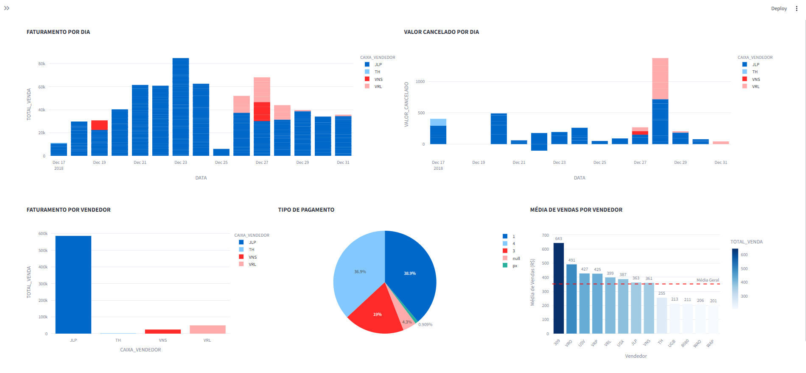

# 📊 Dashboard de Vendas

Este projeto apresenta um **Dashboard interativo** desenvolvido em **Python**, com foco na análise de desempenho de vendas, cancelamentos e métodos de pagamento.  
O objetivo é fornecer uma visão clara e visual dos principais indicadores comerciais.

---

## 🚀 Funcionalidades

- **Faturamento por Dia**: gráfico de barras mostrando o total de vendas por data.
- **Valor Cancelado por Dia**: análise dos cancelamentos ao longo do período.
- **Faturamento por Vendedor**: comparação de desempenho entre vendedores.
- **Tipo de Pagamento**: distribuição dos métodos de pagamento utilizados.
- **Média de Vendas por Vendedor**: cálculo da média de vendas com linha de referência.

---

## 🛠️ Tecnologias Utilizadas

- Python 3.x
- Bibliotecas:
  - `pandas` para manipulação de dados
  - `matplotlib` e `seaborn` para visualização
  - `jupyter notebook` (opcional) para exploração interativa
 
  

